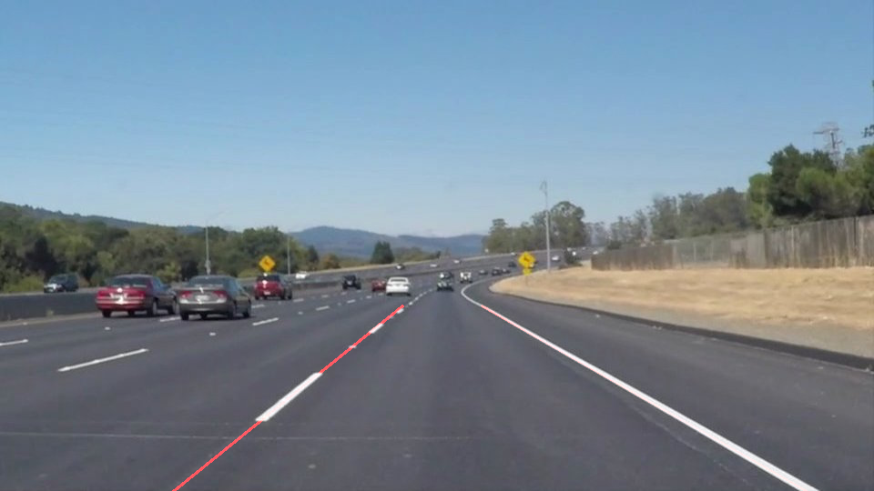
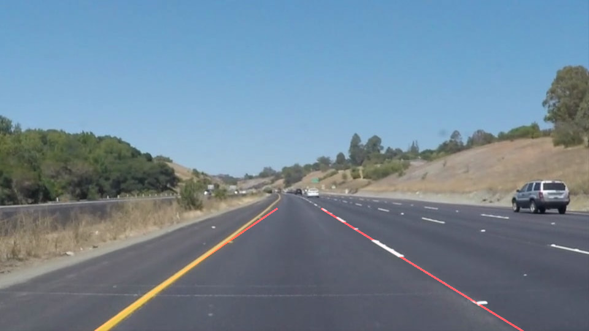
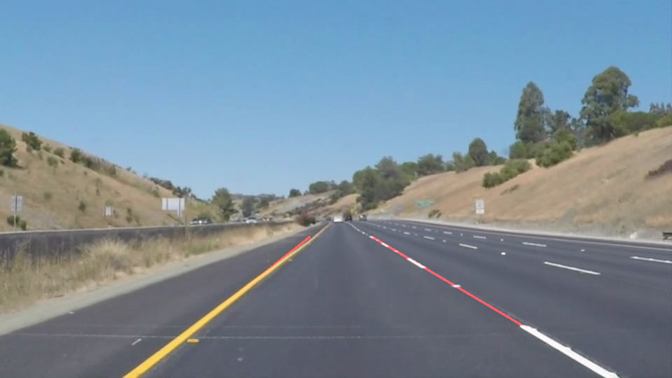

# **Finding Lane Lines on the Road** 

Overview
---

When we drive, we use our eyes to decide where to go.  The lines on the road that show us where the lanes are act as our constant reference for where to steer the vehicle.  Naturally, one of the first things we would like to do in developing a self-driving car is to automatically detect lane lines using an algorithm.

This project detects lane lines in images using Python and OpenCV.

Following is the extremely satisfying output of this project:

Also, below is the result of the above exercise being applied to detect lanes in a video. Clicking on below will open a new window. Click on "View Raw" after that
to download and play video.

Do checkout the other videos and images in this project!!!

